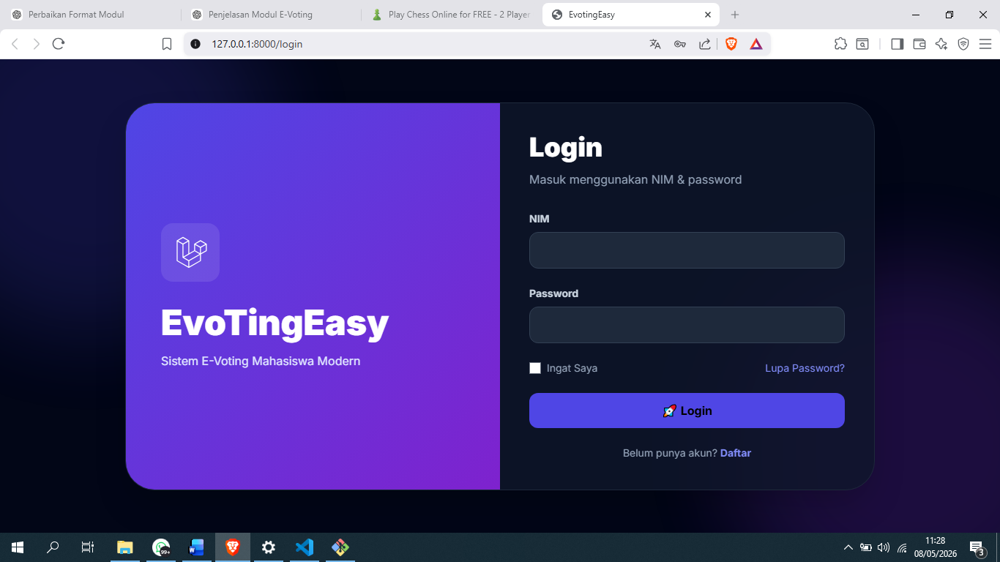
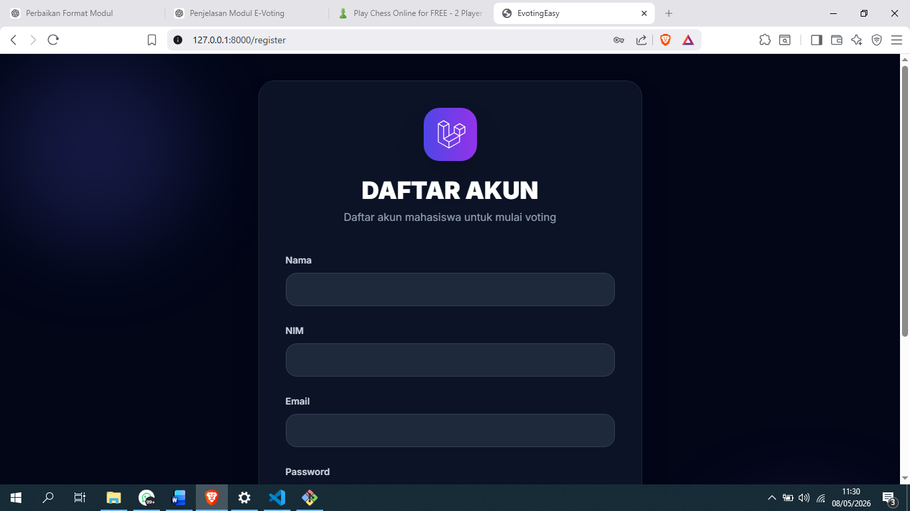
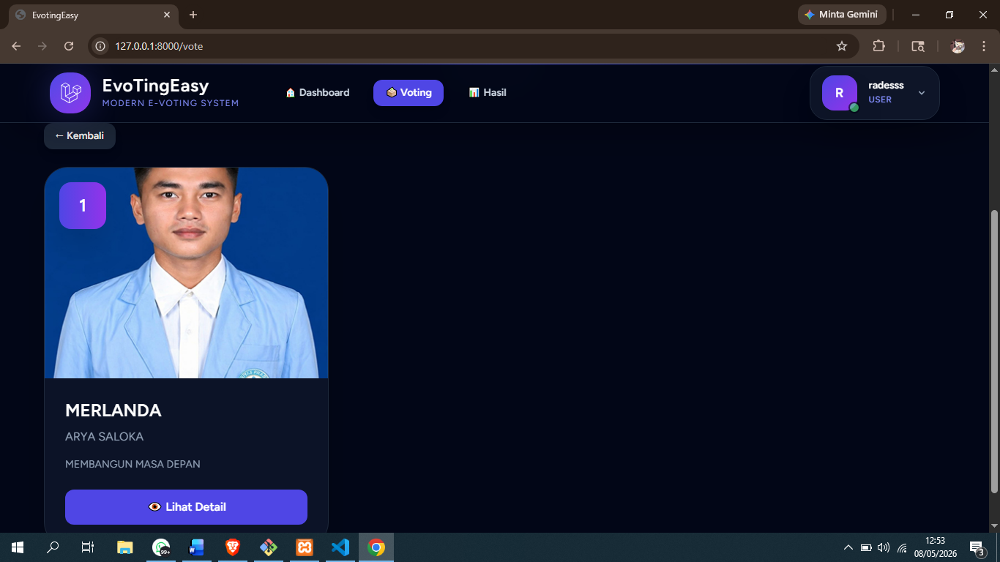
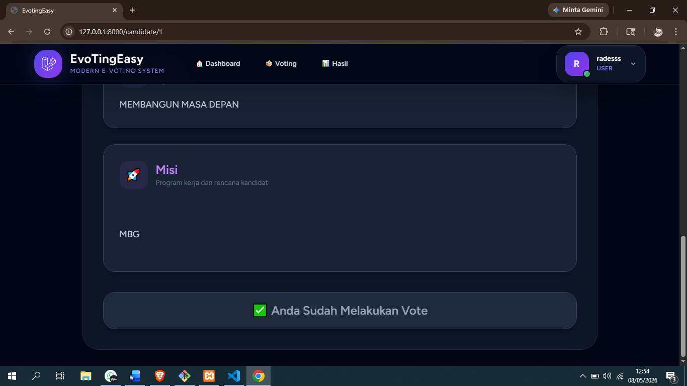
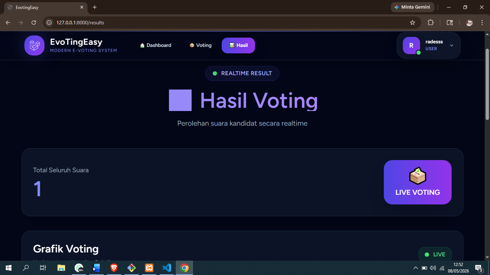

<div align="center">


<br>


<br><br>


<br><br>


</div>

---

<table>
<tr>
<td width="55%">

#  About Me


<br>

```yaml
Name: Rades astria dewangga
Nim: 202430040
Role: Cyber Security & Developer
Learning: Linux, Web, Networking
Focus: CTF & Open Source
```

### 🌸 Details

- 🎓 Student & Tech Enthusiast  
- 💻 Love Linux and Open Source  
- ⚔ Interested in Cyber Security  
- 🌙 Dark Aesthetic Enjoyer  
- ☕ Coding at midnight vibes  
- 🚀 Building cool and useful projects  

</td>

<td width="45%">

<div align="center">


<br><br>


</div>

</td>
</tr>
</table>

---

<table>
<tr>
<td width="55%">

# 📂 Archive

<div align="center">


<br>


</div>

<br>

```bash
[ SYSTEM LOG ]
> Initializing archive...
> Loading cybersecurity notes...
> Injecting reverse engineering files...
> Connecting linux modules...
> Access granted.
```

<br>

- 🕶 Cyber Security Writeup  
- ⚔ Reverse Engineering Notes  
- 🌐 Networking Documentation  
- 🐧 Linux Customization  
- 💻 Open Source Projects  
- 🔥 Experimental UI Design  
- 🌙 Dark Theme Collections  

<br>

<div align="center">


<br><br>


</div>

</td>

<td width="45%">

<div align="center">


<br><br>


</div>

</td>
</tr>
</table>

<div align="center">


<br>


</div>

---

<h1 align="center">📸 System Preview</h1>

---

## 🔐 Login Page
Halaman login untuk admin dan user sebelum masuk ke dalam sistem E-Voting.

<p align="center">
  
</p>

<br>

<div align="center">

</div>

---

## 📝 Register Page
Halaman registrasi akun baru agar pengguna dapat mengakses sistem voting online.

<p align="center">
  
</p>

---

## 📊 Admin Dashboard
Dashboard admin yang menampilkan informasi utama sistem seperti data voting, kandidat, dan statistik pengguna.

<p align="center">
  
</p>

---

## 👥 Participant Management
Halaman admin untuk menampilkan peserta atau user yang akan mengikuti proses voting.

<p align="center">
  
</p>

---

## 🗳 Candidate Management
Halaman admin untuk mengelola dan menampilkan kandidat yang akan dipilih dalam proses voting.

<p align="center">
  
</p>

---

## 👤 User Candidate View
Halaman user yang menampilkan daftar kandidat yang tersedia untuk dipilih pada sistem E-Voting.

<p align="center">
  
</p>

---

## ✅ Voting Status
Halaman yang menampilkan bahwa pengguna telah berhasil melakukan voting.

<p align="center">
  
</p>

---

## 📈 Voting Result
Halaman hasil voting yang menampilkan perolehan suara dan hasil akhir pemilihan.

<p align="center">
  
</p>

---

<div align="center">


</div>

---

# ⚔ Tech Stack

<div align="center">


<br><br>


</div>

---

# Github Stats

<div align="center">


</div>

---

# 🌐 Social Media

<div align="center">

<a href="https://instagram.com/USERNAME">

</a>

<a href="https://discord.com/users/ID">

</a>

<a href="https://github.com/RadesCoyy">

</a>

</div>

---

# 🐍 Contribution Snake

<div align="center">


</div>

---

<div align="center">


</div>